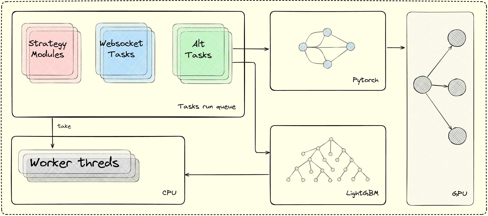
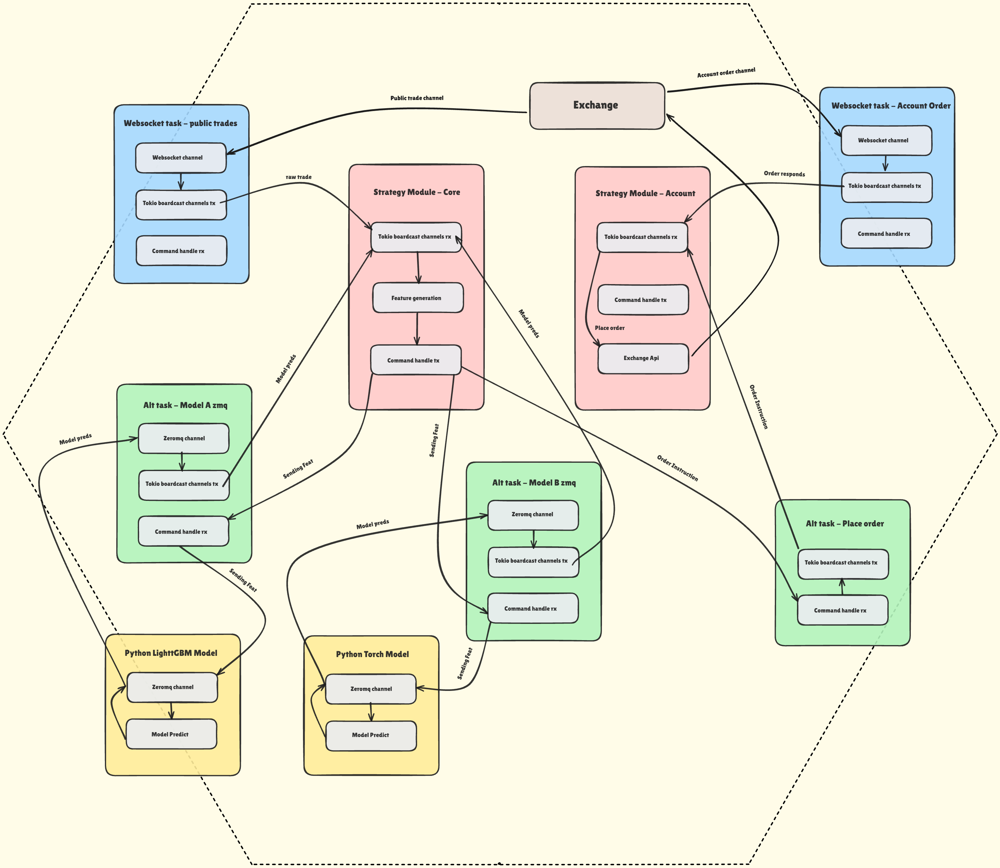

# Extrema Infra

A quantitative trading environment built in Rust.

- Event-driven, channel-based, and designed for modular strategy execution across multiple exchanges.

- Maximizes runtime efficiency through **static dispatch** and promotes scalability with **Heterogeneous Lists (HList)** for strategy registration.  

At its core: **One unified framework for multiple exchanges, multiple strategies, zero runtime boxing.**

---

## SOTA Usages

Explore state-of-the-art example usages, architecture walkthroughes, and community Q&A—no need to run it, just see how strategies and data flows are structured.

👉 **Join the discussion & explore examples:**  
[GitHub Discussions – SOTA Usages](https://github.com/Lqz13Th/extrema_infra/discussions)

---

## Key Features
- **Machine Learning Integration Across Languages**
  - Rust generates high-throughput features for low-latency trading.
  - Features are sent via ZeroMQ to Python ML models (Torch, GBM, Transformer, etc.).
  - Predictions returned asynchronously to Rust for signal generation and order execution.

- **Unified Exchange Abstraction**
  - All exchanges (Hyperliquid, Binance, etc.) normalized into unified `Market` enum + structs.
  - Strategies write once, run anywhere.

- **Broadcast-based Data Distribution**
  - Subscribe once, broadcast to many.
  - Multiple strategies consume the same feed without extra I/O.

- **Static Efficiency**
  - No dynamic boxing, no runtime dispatch.
  - Unified REST & WS interfaces with pre-converted data.

- **Lock-Free Concurrency**
  - Message passing via channels and broadcast without mutex locks.
  - Eliminates contention, ensuring **low-latency, high-throughput** event delivery.
  - Perfect for real-time trading workloads.

---

# Extrema Infra Architecture



---

## Why HList?

Traditional frameworks force strategies into **homogeneous containers** (e.g., `Vec<Box<dyn Strategy>>`), which means:
- Runtime overhead due to dynamic dispatch (`vtable` lookups).  
- Possible type erasure issues.  
- Harder to leverage compile-time optimizations.

With **HList**:
- **Heterogeneous strategies** (different struct types) can be stored in one container.  
- **Compile-time guarantees**: only strategies implementing the `Strategy` trait can be registered.  
- **Zero-cost abstraction**: static dispatch, no `Box`, no dynamic allocation.  
- **Maximum flexibility**: easily mix and match different strategy types while keeping everything static.

---

## Traditional vs HList Approach

| Aspect                    | Traditional Vec<Box<dyn Trait>> | HList-based Extrema Infra     |
|---------------------------|---------------------------------|-------------------------------|
| **Dispatch**              | Dynamic (runtime `vtable`)      | Static (compile-time inlined) |
| **Type Safety**           | Runtime only                    | Compile-time enforced         |
| **Performance**           | Extra indirection, heap alloc   | Zero overhead, no heap alloc  |
| **Compile-time Checking** | Limited                         | Full (trait bounds enforced)  |

---

## Strategy Execution Model
- Trait-driven: `on_trade`, `on_candle`, `on_lob`.
- HList ensures safe registration of multiple strategy types.
- All infra timestamps are unified to microseconds (µs).
- All instrument names returned by the internal API are automatically normalized.

Instrument naming conventions:

- Crypto: underscore-separated, e.g., BTC_USDT_PERP
- Stock: exchange dot notation, e.g., AAPL_NASDAQ_EQ

---

## Strategy Traits

The extrema_infra crate provides the core traits to implement trading strategies:

- **Strategy**  
  Entry point of your strategy. Defines how it executes and spawns tasks.

- **EventHandler**
  -  handle timer or alternative task events.
  -  handle Limit Order Book (LOB) events like trades, orderbook, candles, account orders.
  -  handle asynchronous model prediction events.

- **CommandEmitter**  
  Used to initialize and register command handles for communication with tasks.

A minimal strategy must implement at least `Strategy` + `CommandEmitter` + `EventHandler`.

---

## LOB Exchange API Traits

These traits apply only to LOB-based exchanges (Binance, OKX, dYdX, Hyperliquid, etc.)

For connecting to exchanges, you need to implement these traits for each exchange client:

- **LobWebsocket**  
  Defines how to build subscription/connect messages for websocket streams.

- **MarketLobApi = LobPublicRest + LobPrivateRest**
  - **LobPublicRest**: market data (ticker, orderbook, candles, instruments).
  - **LobPrivateRest**: trading operations (init API key, place/cancel orders, get balance, get positions).

---

## TLS / rustls Initialization (Important)

This framework relies on `rustls` for secure REST and WebSocket connections
(e.g. via `reqwest` and `tokio-tungstenite`).

Starting from **rustls v0.23**, the TLS crypto backend (e.g. `aws-lc-rs` or `ring`)
**must be explicitly selected by the final binary**.

### ⚠️ Required for all binary crates

Before using any TLS-enabled functionality (REST / WebSocket),
the executable **must install a default CryptoProvider**:

```rust
#[tokio::main]
async fn main() { 
  rustls::crypto::aws_lc_rs::default_provider()
          .install_default()
          .expect("failed to install rustls crypto provider");

  // start tokio runtime, env builder, etc.
}
```

---

## Example: Spawn example strategy

On your strategy Cargo.toml:

```toml
[package]
name = "strategy"
version = "0.1.0"
edition = "2024"

[dependencies]
# Local development
extrema_infra = { path = "../extrema_infra" }

# Or remote
# extrema_infra = { git = "https://github.com/Lqz13Th/extrema_infra", features = ["all"] }

# Tokio async runtime
tokio = { version = "1.49", features = ["full"] }

# TLS / Cryptography
rustls = { version = "0.23", features = ["aws-lc-rs"] }

# Logging
tracing = "0.1"
tracing-subscriber = "0.3"
```

Then, on your main.rs:

```rust
use std::{sync::Arc, time::Duration};
use tracing::info;

use extrema_infra::prelude::*;

#[derive(Clone)]
struct EmptyStrategy;

impl Strategy for EmptyStrategy {
  async fn initialize(&mut self) {
    info!("[EmptyStrategy] Executing...");
  }
}

impl CommandEmitter for EmptyStrategy {
  fn command_init(&mut self, _command_handle: Arc<CommandHandle>) {
    info!("[EmptyStrategy] Command channel initialized");
  }

  fn command_registry(&self) -> Vec<Arc<CommandHandle>> {
    Vec::new()
  }
}

impl EventHandler for EmptyStrategy {
  async fn on_schedule(&mut self, msg: InfraMsg<AltScheduleEvent>) {
    info!("[EmptyStrategy] AltEventHandler: {:?}", msg);
  }
}

#[tokio::main]
async fn main() {
  tracing_subscriber::fmt::init();
  info!("Logger initialized");

  let alt_task = AltTaskInfo {
    alt_task_type: AltTaskType::TimeScheduler(Duration::from_secs(5)),
    chunk: 1,
    task_base_id: None,
  };

  let env = EnvBuilder::new()
          .with_board_cast_channel(BoardCastChannel::default_alt_event())
          .with_board_cast_channel(BoardCastChannel::default_scheduler())
          .with_task(TaskInfo::AltTask(Arc::new(alt_task)))
          .with_strategy_module(EmptyStrategy)
          .build();

  env.execute().await;
}
```

---

## Latency-sensitive ML strategy
For a practical implementation, see the [complex strategy example](examples/complex_strategy_example.rs).
- **Latency-sensitive task**  
  - Handles order placement, cancel/replace, LOB reaction, etc.
  - Minimal logic, no blocking, no heavy computation.
  - Data sampling etc.

- **Supporting tasks**
  - Order execution, feature generation, Risk checks, Position management etc.
  - These tasks communicate with the latency-sensitive task via channels (**CommandEmitter** → **OrderExecute**) or Rwlock.
  - Using **AltTask** for feature extraction, sending data to Torch prediction via command handle, then generating signals to execute orders.

Latency-sensitive logic can be decomposed into multiple tasks.
where each task handles only a subset of instruments for maximum efficiency. 

Meanwhile, support logic can also be split into dedicated tasks, 
with each task focusing on a single role to maintain clarity and modularity.



---

© 2025 **Extrema Intelligence**. Licensed under the [Apache License 2.0](LICENSE).
