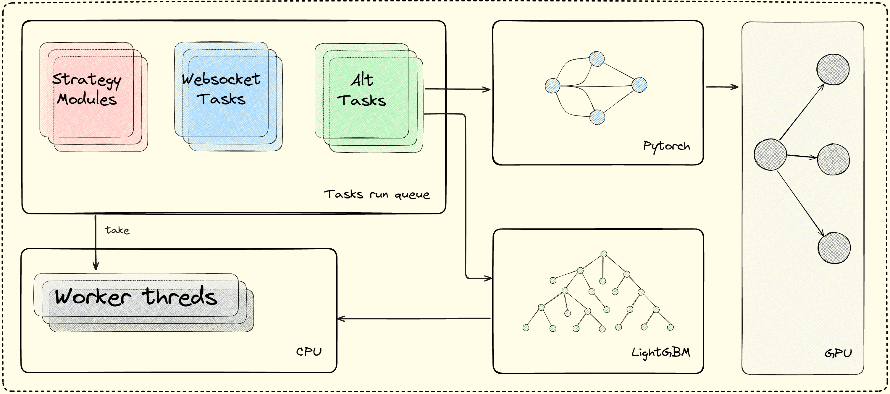
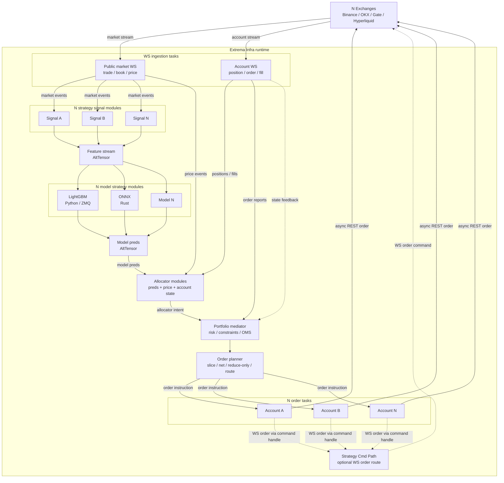

# Extrema Infra

A quantitative trading environment built in Rust.

- Event-driven, channel-based, and designed for modular strategy execution across multiple exchanges.

- Maximizes runtime efficiency through **static dispatch** and promotes scalability with **Heterogeneous Lists (HList)** for strategy registration.

At its core: **One unified framework for multiple exchanges and strategies, with static dispatch at the strategy-registration boundary.**

---

## SOTA Usages

Explore state-of-the-art example usages, architecture walkthroughs, and community Q&A—no need to run it, just see how strategies and data flows are structured.

👉 **Join the discussion & explore examples:**  
[GitHub Discussions – SOTA Usages](https://github.com/Lqz13Th/extrema_infra/discussions)

---

## Key Features

- **Machine Learning Integration Across Languages**
  - Features can be sent via ZeroMQ to Python ML models (Torch, GBM, Transformer, etc.).
  - ONNX models can also run directly inside `extrema_infra` without an external Python service.
  - `AltTensor` is the common dense tensor payload for feature input and model output.
  - Predictions return asynchronously to Rust for signal generation and order execution.

- **Unified Exchange Abstraction**
  - Supported exchange clients normalize common fields into the shared `Market` enum and data structs.
  - Strategies can consume unified types while still handling exchange-specific capabilities where needed.

- **Broadcast-based Data Distribution**
  - Subscribe once, broadcast to many.
  - Multiple strategies consume the same feed without extra I/O.
  - Strategy modules can narrow their runtime subscriptions with `EventMask`.

- **Static Efficiency**
  - Strategy registration avoids `Box<dyn Strategy>` and dynamic dispatch at the strategy-list boundary.
  - Unified REST & WS interfaces with pre-converted data.

- **Channel-based Concurrency**
  - Message passing via Tokio channels and broadcast streams keeps data flow explicit.
  - Reduces shared-state contention for real-time trading workloads.
  - Fits latency-sensitive, multi-consumer data flows.

---

## Extrema Infra Architecture



---

## Architecture Example: From Signal To Execution

Extrema Infra can model signal generation, model inference, allocation, portfolio
mediation, and execution orchestration as independent tasks or strategy modules.
Each module owns local state and communicates through async channels instead of
directly sharing mutable state.


```mermaid
flowchart TB
    EXS["N Exchanges<br/>Binance / OKX / Gate / Hyperliquid"]

    subgraph RT["Extrema Infra runtime"]
        direction TB

        subgraph INGEST["WS ingestion tasks"]
            direction LR
            PUB["Public market WS<br/>trade / book / price"]
            ACC["Account WS<br/>position / order / fill"]
        end

        subgraph SIGS["N strategy signal modules"]
            direction TB
            S1["Signal A"]
            S2["Signal B"]
            S3["Signal N"]
        end

        FEAT["Feature stream<br/>AltTensor"]

        subgraph MODELS["N model strategy modules"]
            direction TB
            M1["LightGBM<br/>Python / ZMQ"]
            M2["ONNX<br/>Rust"]
            M3["Model N"]
        end

        MPRED["Model preds<br/>AltTensor"]
        ALLOC["Allocator modules<br/>preds + price + account state"]
        PM["Portfolio mediator<br/>risk / constraints / OMS"]
        PLAN["Order planner<br/>slice / net / reduce-only / route"]

        subgraph ORDERS["N order tasks"]
            direction TB
            O1["Account A"]
            O2["Account B"]
            O3["Account N"]
        end

        CMD["Strategy Cmd Path<br/>optional WS order route"]
    end

    EXS -->|market stream| PUB
    EXS -->|account stream| ACC

    PUB -->|market events| S1
    PUB -->|market events| S2
    PUB -->|market events| S3
    PUB -->|price events| ALLOC

    S1 --> FEAT
    S2 --> FEAT
    S3 --> FEAT

    FEAT --> M1
    FEAT --> M2
    FEAT --> M3

    M1 --> MPRED
    M2 --> MPRED
    M3 --> MPRED

    MPRED -->|model preds| ALLOC
    ACC -->|positions / fills| ALLOC
    ACC -->|order reports| PM

    ALLOC -->|allocator intent| PM
    PM --> PLAN

    PLAN -->|order instruction| O1
    PLAN -->|order instruction| O2
    PLAN -->|order instruction| O3

    O1 -->|async REST order| EXS
    O2 -->|async REST order| EXS
    O3 -->|async REST order| EXS

    O1 -.->|WS order via command handle| CMD
    O2 -.->|WS order via command handle| CMD
    O3 -.->|WS order via command handle| CMD
    CMD -.->|WS order command| EXS

    ACC -.->|state feedback| PM
```

Signal, model, allocator, and portfolio-mediator components can all be Strategy
Modules. The runtime composes them with websocket tasks, scheduler tasks,
model-prediction tasks, command handles, and account-bound order tasks.

---

## Why HList?

Traditional frameworks force strategies into **homogeneous containers** (e.g., `Vec<Box<dyn Strategy>>`), which means:

- Runtime overhead due to dynamic dispatch (`vtable` lookups).  
- Possible type erasure issues.  
- Harder to leverage compile-time optimizations.

With **HList**:

- **Heterogeneous strategies** (different struct types) can be stored in one container.  
- **Compile-time guarantees**: only strategies implementing the `Strategy` trait can be registered.  
- **Static strategy registration**: no `Box<dyn Strategy>` at the module-list boundary.
- **Maximum flexibility**: easily mix and match different strategy types while keeping everything static.

---

## Traditional vs HList Approach

| Aspect                    | Traditional `Vec<Box<dyn Trait>>` | HList-based Extrema Infra     |
|---------------------------|-----------------------------------|-------------------------------|
| **Dispatch**              | Dynamic (runtime `vtable`)        | Static (compile-time inlined) |
| **Type Safety**           | Runtime only                      | Compile-time enforced         |
| **Strategy registration** | Trait-object indirection          | Concrete types, static dispatch |
| **Compile-time Checking** | Limited                           | Full (trait bounds enforced)  |

---

## Strategy Execution Model

- Trait-driven: `on_trade`, `on_candle`, `on_lob`.
- Optional `EventMask` lets modules subscribe only to callbacks they use.
- HList ensures safe registration of multiple strategy types.
- All infra timestamps are unified to microseconds (µs).
- All instrument names returned by the internal API are automatically normalized.

For a generic end-to-end wiring guide with scheduler, websocket, account-stream,
and multi-module examples, see [docs/usage.md](docs/usage.md).

Instrument naming conventions:

- Crypto: underscore-separated, e.g., BTC_USDT_PERP
- Stock: underscore-separated, e.g., AAPL_NASDAQ_EQ

---

## Strategy Traits

The extrema_infra crate provides the core traits to implement trading strategies:

- **Strategy**  
  Entry point of your strategy. Defines how it executes and spawns tasks.

- **EventHandler**
  - handle timer or alternative task events.
  - handle Limit Order Book (LOB) events like trades, orderbook, candles, account orders.
  - handle asynchronous model prediction events.

- **CommandEmitter**  
  Used to initialize and register command handles for communication with tasks.

A minimal strategy must implement at least `Strategy` + `CommandEmitter` + `EventHandler`.

---

## ONNX Model Runner

`extrema_infra` supports local ONNX inference through `AltTaskType::ModelPreds(ModelRunner::Onnx(...))`.
Enable the `model_onnx` feature, or `model_runner` / `all`, to make this backend available.

- The ONNX model is loaded once during task initialization.
- Inference requests are routed through a dedicated worker thread owned by the ONNX task.
- Callers send an `AltTensor` feature payload and receive an `AltTensor` prediction payload.
- For multi-output models, select a specific output with `output_index`; otherwise the runner picks the first decodable tensor output.

You can initialize the runner in two ways:

1. Pass a direct `.onnx` path.
2. Pass a JSON config path:

```json
{
  "model_path": "models/demo.onnx",
  "model_name": "demo_model",
  "output_index": 0
}
```

The JSON config supports:

- `model_path`: required, relative or absolute path to the ONNX file
- `model_name`: optional, added into prediction metadata
- `output_index`: optional, useful for multi-output models such as classifier label + probability outputs

### `AltTensor` Contract

`AltTensor` is a generic dense tensor carrier:

- `data`: row-major / C-order flattened `Vec<f32>`
- `shape`: original tensor shape before flattening
- `data.len()` must equal the product of `shape`
- infra does not perform implicit transpose / squeeze / reshape

Typical examples:

- Tabular feature row: `shape=[1, 4]`, `data=[f1, f2, f3, f4]`
- Multi-asset feature row: `shape=[1, assets, features]`
- Conv input: `shape=[1, 1, 3, 3]`
- Regression output: `shape=[1, 1]`
- Classification probabilities: `shape=[1, classes]`

When exporting from PyTorch, the intended semantics are equivalent to:

```python
tensor = tensor.to(torch.float32).contiguous()
data = tensor.view(-1).tolist()
shape = list(tensor.shape)
```

---

## LOB Exchange API Traits

These traits apply to LOB-based exchanges such as Binance, OKX, Gate, and Hyperliquid.

Client implementors use these traits to expose exchange capabilities. Applications can
use the built-in clients directly or dispatch through `LobClients`. Operations that a
selected client does not support return `InfraError::Unimplemented`.

- **LobWebsocket**  
  Defines how to build subscription/connect messages for websocket streams.

- **MarketLobApi = LobPublicRest + LobPrivateRest**
  - **LobPublicRest**: market data (ticker, orderbook, candles, instruments).
  - **LobPrivateRest**: trading operations (init API key, place/cancel orders, get balance, get positions).

---

## TLS / rustls Initialization (Important)

This framework relies on `rustls` for secure REST and WebSocket connections
(e.g. via `reqwest` and `tokio-tungstenite`).

Starting with **rustls v0.23**, the TLS crypto backend (e.g. `aws-lc-rs` or `ring`)
**must be explicitly selected by the final binary**.

### ⚠️ Required for binaries that use TLS-enabled REST/WebSocket functionality

Before using any TLS-enabled functionality (REST / WebSocket),
the executable **must install a default CryptoProvider**:

```rust
#[tokio::main]
async fn main() { 
  rustls::crypto::aws_lc_rs::default_provider()
          .install_default()
          .expect("failed to install rustls crypto provider");

  // start tokio runtime, env builder, etc.
}
```

---

## Example: Spawn example strategy

Install the latest published crate:

```bash
cargo add extrema_infra --features all
```

In your strategy `Cargo.toml`:

```toml
[package]
name = "strategy"
version = "0.1.0"
edition = "2024"

[dependencies]
extrema_infra = { version = "0.2", features = ["all"] }

# Enable exchange clients explicitly when needed.
# extrema_infra = { version = "0.2", features = ["hyperliquid", "okx"] }
# extrema_infra = { version = "0.2", features = ["lob_clients"] }

# For local development.
# extrema_infra = { path = "../extrema_infra", features = ["all"] }

# Or use the latest default branch directly.
# extrema_infra = { git = "https://github.com/Lqz13Th/extrema_infra", features = ["all"] }

# Tokio async runtime
tokio = { version = "1.53.0", features = ["full"] }

# TLS / Cryptography
rustls = { version = "0.23", features = ["aws-lc-rs"] }

# Logging
tracing = "0.1"
tracing-subscriber = "0.3"
```

Then in `main.rs`:

```rust,no_run
use std::{sync::Arc, time::Duration};
use tracing::info;

use extrema_infra::prelude::*;

#[derive(Clone)]
struct EmptyStrategy {
  registry: Arc<CommandRegistry>,
}

impl EmptyStrategy {
  fn new() -> Self {
    Self {
      registry: Arc::new(CommandRegistry::default()),
    }
  }
}

impl Strategy for EmptyStrategy {
  async fn initialize(&mut self) {
    info!("[EmptyStrategy] Executing...");
  }
}

impl CommandEmitter for EmptyStrategy {
  fn command_init(&mut self, registry: Arc<CommandRegistry>) {
    self.registry = registry;
    info!("[EmptyStrategy] Command channel initialized");
  }

  fn command_registry(&self) -> Arc<CommandRegistry> {
    self.registry.clone()
  }
}

impl EventHandler for EmptyStrategy {
  async fn on_schedule(&mut self, msg: InfraMsg<AltScheduleEvent>) {
    info!("[EmptyStrategy] AltEventHandler: {:?}", msg);
  }
}

#[tokio::main]
async fn main() {
  tracing_subscriber::fmt::init();
  info!("Logger initialized");

  let alt_task = AltTaskInfo {
    alt_task_type: AltTaskType::TimeScheduler(Duration::from_secs(5)),
    chunk: 1,
    task_base_id: None,
  };

  let env = EnvBuilder::new()
          .with_board_cast_channel(BoardCastChannel::default_alt_event())
          .with_board_cast_channel(BoardCastChannel::default_scheduler())
          .with_task(TaskInfo::AltTask(Arc::new(alt_task)))
          .with_strategy_module(EmptyStrategy::new())
          .build();

  env.execute().await;
}
```

---

## Latency-sensitive ML strategy

For a practical implementation, see the [complex strategy example](examples/complex_strategy_example.rs).

- **Latency-sensitive task**  
  - Handles order placement, cancel/replace, LOB reaction, etc.
  - Minimal logic, no blocking, no heavy computation.
  - Samples only the data needed by the fast path.

- **Supporting tasks**
  - Order execution, feature generation, risk checks, position management, and evaluation.
  - These tasks communicate with the latency-sensitive task through channels (**CommandEmitter** -> **OrderExecution**) and task-local state.
  - Use **AltTask** for feature extraction, sending data to a ZMQ or ONNX model runner via command handle, then generating signals to execute orders.

Latency-sensitive logic can be decomposed into multiple tasks, with each task
handling only a subset of instruments for maximum efficiency.

---

## License

This project is licensed under the [Apache 2.0 license](LICENSE).
